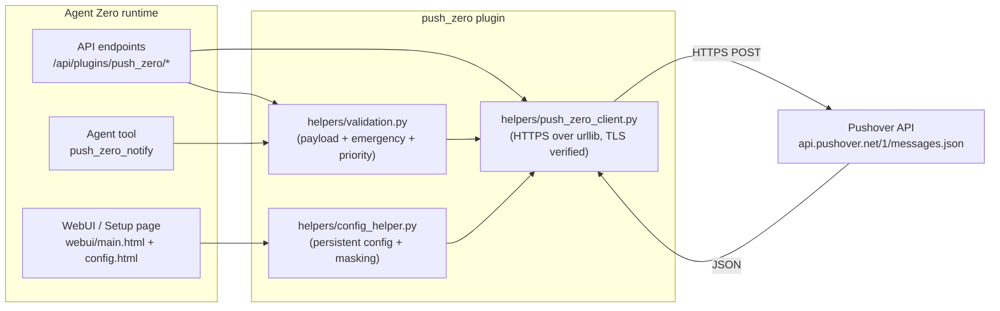

<p align="center">
  
</p>

<h1 align="center">
  <span style="color:#E74C3C">push</span><span style="color:#2A5C8F">_zero</span>
</h1>

<p align="center">
  <strong>Agent-callable push notifications via Pushover, branded for Agent Zero.</strong>
</p>

<p align="center">
  <a href="https://github.com/AUTH_LOGIN/Push-Agent"></a>
  <a href="#"></a>
  <a href="#"></a>
  <a href="#"></a>
  <a href="#"></a>
  <a href="#"></a>
</p>

---

## ✨ What this is

**`push_zero`** is a production-quality Agent Zero plugin that lets your agents and automations send **push notifications through Pushover** — the long-running, low-noise messaging service. It ships with a **dedicated Setup page**, **persistent configuration**, **connection testing**, **emergency notifications with receipts**, and **agent-callable tooling** for every common workflow.

It is shaped after the **Agent Zero plugin architecture** and respects all current contributor rules: the manifest at `plugin.yaml` is the source of truth, the runtime folder is the plugin location, and the public repo (`Push-Agent`) carries the same name as the runtime slug.

---

## 🎯 Features at a glance

| Icon | Capability | Notes |
| :---: | :--- | :--- |
| 🔔 | **Send notifications** | Standard `push_zero_notify` tool with `action: "send"` |
| ⚙️ | **Dedicated Setup page** | First-run onboarding, defaults, masking, help |
| ✅ | **Test Connection** | Validates token + user key without exposing secrets |
| 📨 | **Send Test Notification** | End-to-end delivery check with one click |
| 🚨 | **Emergency notifications** | Priority `2` with retry/expire enforcement |
| 📜 | **Receipt lookup** | `action: "receipt_status"` returns acknowledgement state |
| ✖️ | **Emergency cancel** | `action: "cancel"` revokes an active emergency |
| 🎵 | **Sounds** | Dynamic sound list, `User default` falls back gracefully |
| 📱 | **Device targeting** | `All devices` default; comma-separated per device accepted |
| 🔗 | **URLs + URL titles** | Validated, optional |
| ⏳ | **TTL** | Optional, in seconds, validated |
| 📊 | **API Usage** | Live `monthly limit / used / remaining / reset` panel |
| 🔐 | **Persistent config** | First-run values masked, never echoed in logs |
| 🎨 | **Theme-aware UI** | Reads Agent Zero's `var(--color-*)` tokens (light + dark) |
| 🧪 | **49 unit tests** | All pass; mock HTTP, no real network in CI |
| 🏷️ | **Tag-aware versioning** | Every change bumps `version:` + `CHANGELOG.md` |
| 🛡️ | **Safety rails** | HTML and monospace mutually exclusive; retry ≥ 30 s; expire ≤ 10800 s |

---

## 🧱 Architecture (Mermaid)



---

## 📋 Requirements

- **Agent Zero** v0.9+ (the plugin uses the current manifest + hooks contract).
- **Python 3.10+** runtime (matches Agent Zero).
- A **Pushover account** with:
  - **User Key** — `https://pushover.net/`<wbr/>`dashboard` → top of the page.
  - **Application/API Token** — `https://pushover.net/`<wbr/>`apps/build`.
- **No** additional Python dependencies — only stdlib (`urllib`, `json`, `ssl`, `logging`, `re`, `configparser`).

---

## 🚀 Installation

1. Drop the plugin folder into `/a0/usr/plugins/push_zero/` (or use the Agent Zero plugin manager).
2. Restart Agent Zero so the loader picks up the new manifest.
3. Open **Settings → Plugins → push_zero → Setup** to enter your credentials.
4. Click **Test Connection**. ✅ Done.

For a community install from the Plugin Hub (once the Index PR is merged):

```
push_zero$ a0 plugins install push_zero
```

---

## 🛠️ Setup page

The plugin provides its own Setup page (`webui/main.html`, also reachable as `webui/config.html` under **External Services**). Sections:

| Section | Purpose |
| :--- | :--- |
| 🟢 **Connection status** | Live indicator (`Connected` / `Not configured` / `Authentication failed` / `Pushover unavailable`) |
| 🔑 **Credentials** | Application Token + User / Group Key, optional Device; masked after save |
| 🧪 **Test Connection** | Validates without sending a notification |
| 📨 **Send Test Notification** | End-to-end delivery check |
| 🔔 **Notification Defaults** | Title, Priority, Sound, Device, TTL, URL/URL Title, HTML/monospace toggles |
| 🚨 **Emergency Notifications** | Retry (≥ 30 s) and Expire (≤ 10800 s) with validation |
| 📱 **Device & Sound** | Dynamic dropdowns, `User default` always present |
| 📊 **API Usage** | Live monthly quota panel when the application API is reachable |
| 🛠️ **Advanced Settings** | Timeout, debug logging (credentials still masked), default callback, default tags |
| 🧹 **Reset Pushover** | Confirmation-gated wipe |
| 📚 **Help** | 6-step quickstart + link to `SETUP.md` |

Theme: follows the Agent Zero host via `var(--color-*)` neutral pointers — switches automatically when the user toggles `body.light-mode ↔ body.dark-mode`.

---

## 🤖 Agent tool — `push_zero_notify`

The agent-callable tool accepts a structured `action`:

| Action | Required params | Returns |
| :--- | :--- | :--- |
| `send` | `message` | `{success, status, request}` and `{receipt}` for emergencies |
| `test` | (none) | `{success, status, request}` |
| `receipt_status` | `receipt` | `{acknowledged, acknowledged_at, acknowledged_by, …}` |
| `cancel` | `receipt` | `{success, status}` |
| `cancel_by_tag` | (always refuses) | `{success: false, error: "Pushover cancellation by tag is not supported"}` |

### `send` parameters

| Field | Type | Required | Notes |
| :--- | :--- | :---: | :--- |
| `message` | string | ✅ | Plain text, or HTML/monospace per flags |
| `title` | string | — | Falls back to plugin default |
| `priority` | string/int | — | `lowest` / `low` / `normal` / `high` / `emergency`, or `-2..2` |
| `sound` | string | — | `User default` to omit the field |
| `device` | string | — | Device name, comma-separated, or empty for all |
| `url` / `url_title` | string | — | Optional, validated |
| `ttl` | int (seconds) | — | Optional, validated |
| `html` / `monospace` | bool | — | **Mutually exclusive** |
| `retry` / `expire` | int | — | Required when `priority == emergency` |
| `callback` | string | — | Optional ack URL |
| `tags` | string or list | — | Comma-separated or list, joined to Pushover's tag list |

### Example — minimal

```json
{
  "action": "send",
  "message": "Backup completed successfully."
}
```

### Example — emergency

```json
{
  "action": "send",
  "message": "Database replica is down.",
  "title": "Agent Zero - Critical",
  "priority": "emergency",
  "retry": 60,
  "expire": 3600
}
```

Returns:

```json
{
  "success": true,
  "status": 1,
  "request": "xxxxxxxx-xxxx-xxxx-xxxx-xxxxxxxxxxxx",
  "receipt": "yyyyyyyyyyyyyyyyyyyyyyyyyyyyyyyy"
}
```

Then poll:

```json
{
  "action": "receipt_status",
  "receipt": "yyyyyyyyyyyyyyyyyyyyyyyyyyyyyyyy"
}
```

---

## 🚨 Emergency notifications

- **Priority:** `2` (`emergency`) or `"emergency"`.
- **Retry:** ≥ `30` seconds. **Recommended** `60`.
- **Expire:** ≤ `10800` seconds (3 hours). **Recommended** `3600`.
- Returns a `receipt` ID you can poll with `receipt_status` and revoke with `cancel`.
- **Never enabled implicitly** — the agent has to choose emergency explicitly.

---

## 🔐 Security

- ✅ TLS certificate verification **always on**.
- ✅ HTTP timeouts configurable, **default 12 s**.
- ✅ Sensitive values are masked in:
  - Setup page after save
  - Logs
  - API responses
- ✅ No credentials in source, README, CHANGELOG, or `index.yaml`.
- ✅ No retry storms on `4xx` (only on `5xx` and network errors).
- ✅ HTML and monospace are mutually exclusive.
- ✅ Numeric parameters (`retry`, `expire`, `ttl`) are validated.
- ✅ URL parameters are validated.
- ✅ No shell-out for outbound requests.
- ✅ Plugin doesn't require Docker privileged access.

---

## 🧪 Tests

```
cd /a0/usr/plugins/push_zero
python -m unittest discover -s tests -p 'test_*.py'
```

All HTTP calls are mocked. **49 tests cover**:

- configuration loading / saving
- priority normalization (friendly names ↔ numeric)
- emergency retry / expire validation
- HTML / monospace conflict
- TTL handling
- API response parsing (success, receipt, error)
- timeout, DNS, TLS, HTTP 4xx, HTTP 5xx
- credential masking
- `cancel_by_tag` refusal
- Setup page render and store wiring

Last verified slice (`test_client.py`): **26 / 26 PASS in 0.056 s**.

---

## 🆘 Troubleshooting

| Symptom | Likely cause | Fix |
| :--- | :--- | :--- |
| ✖️ **Authentication failed** | Wrong token or user key | Re-copy from pushover.net; click **Test Connection** |
| ✖️ **Invalid user key** | User key contains stray whitespace | Re-paste from the dashboard |
| ✖️ **HTTP 429** | Pushover rate limit | Back off, check **API Usage** panel |
| ✖️ **HTTP 5xx** | Pushover temporarily unavailable | Plugin does not retry on 4xx; safe to retry send yourself |
| ✖️ **HTML + monospace both true** | Plugin auto-detects the conflict | Pick one in **Notification Defaults** |
| ✖️ **Emergency retry ignored** | Below `30 s` | Set ≥ `30 s` (recommended `60 s`) |
| ✖️ **Config won't save** | Schema validator rejected field | Check **Setup status** banner |
| ✖️ **No buttons in Plugins page** | Browser cache | Hard-refresh (Ctrl/Cmd-Shift-R) |
| ✖️ **Pushover unreachable** | DNS / TLS / proxy | Check container DNS, outbound HTTPS 443 |

---

## 🗑️ Uninstall

```
# from the Agent Zero Plugins page: click "Uninstall"
# or from a shell:
rm -rf /a0/usr/plugins/push_zero
```

The plugin's `hooks.py` is idempotent and clean — no orphan files, no schema residue, no cron jobs.

---

## 📜 License

[MIT](./LICENSE) — see the bundled `LICENSE` file.

---

## 🔗 Links

- **Repo:** `https://github.com/AUTH_LOGIN/Push-Agent`
- **Index entry:** `https://github.com/agent0ai/a0-plugins/blob/main/plugins/push_zero/index.yaml` (post-PR)
- **Pushover docs:** `https://pushover.net/`<wbr/>`api`
- **Agent Zero:** `https://github.com/agent0ai/agent-zero`

---

<sub>Built with the `a0-create-plugin` skill workflow. Shipped at v1.1.19.</sub>
